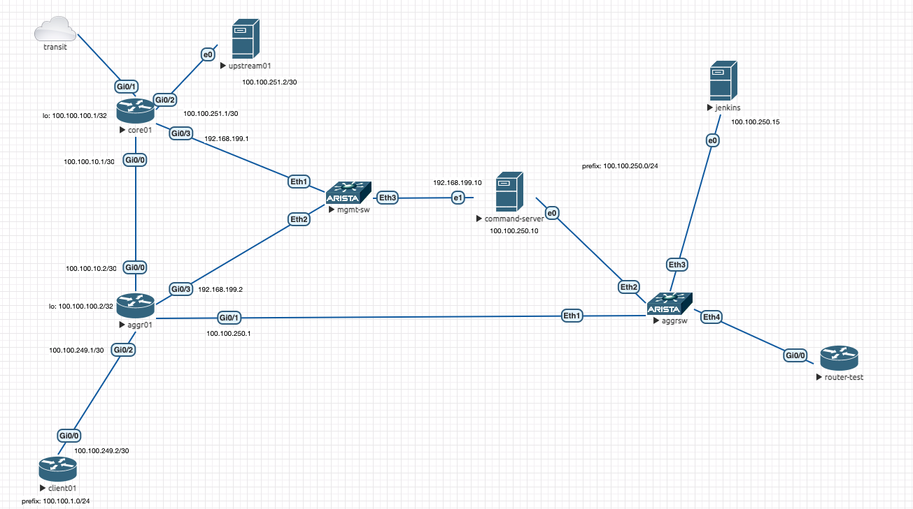

## Network as Code - Ansible Playbooks

Repo used for Network as Code demonestration.  

####Topoloyg (eve-ng):

####Components:

command-server for running ansible scripts  
jenkins for ci/cd  
local-asn: 65534  

####Ansible module structure:  

	.
	├── Jenkinsfile
	├── README.md
	├── ansible.cfg
	├── ansible.log
	├── group_vars
	│   └── routers
	├── host_vars
	│   ├── aggr01.yml
	│   └── core01.yml
	├── hosts
	├── images
	│   └── topology_eve_ng.png
	├── main-commonconfig.yml
	├── main-interface.yml
	├── main-routing.yml
	├── main-saveconfig.yml
	├── roles
	│   ├── common
	│   │   ├── README.md
	│   │   ├── defaults
	│   │   │   └── main.yml
	│   │   ├── handlers
	│   │   │   └── main.yml
	│   │   ├── meta
	│   │   │   └── main.yml
	│   │   ├── tasks
	│   │   │   ├── acl.yml
	│   │   │   ├── main.yml
	│   │   │   ├── nameserver.yml
	│   │   │   ├── ntp.yml
	│   │   │   └── snmp.yml
	│   │   ├── tests
	│   │   │   ├── inventory
	│   │   │   └── test.yml
	│   │   └── vars
	│   │       └── main.yml
	│   ├── interfaces
	│   │   ├── README.md
	│   │   ├── defaults
	│   │   │   └── main.yml
	│   │   ├── handlers
	│   │   │   └── main.yml
	│   │   ├── meta
	│   │   │   └── main.yml
	│   │   ├── tasks
	│   │   │   └── main.yml
	│   │   ├── templates
	│   │   │   └── subints.j2
	│   │   ├── tests
	│   │   │   ├── inventory
	│   │   │   └── test.yml
	│   │   └── vars
	│   │       └── main.yml
	│   └── routing
	│       ├── README.md
	│       ├── defaults
	│       │   └── main.yml
	│       ├── handlers
	│       │   └── main.yml
	│       ├── meta
	│       │   └── main.yml
	│       ├── tasks
	│       │   ├── bgp.yml
	│       │   ├── main.yml
	│       │   ├── ospf.yml
	│       │   └── ospfv3.yml
	│       ├── tests
	│       │   ├── inventory
	│       │   └── test.yml
	│       └── vars
	│           └── main.yml
	├── secrets
	│   └── vault.yml
	├── show_bgp_neighbor.yml
	└── show_version.yml

